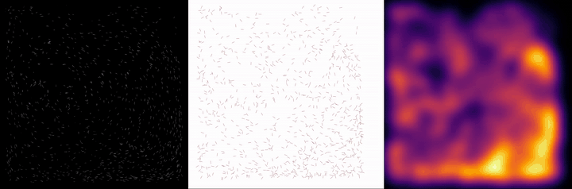

# Mean-Field Data Assimilation

Code, notebooks, and figures for the mean-field data assimilation experiments.
Large simulation outputs (`data/`, `data_*/`) are excluded from this repository;
each case can be regenerated by running the corresponding `simulation.py` /
`run_me` scripts.

## Fish-school assimilation — 3-panel comparison

Full-resolution MP4: [`fish_simulation/comparison_3panel.mp4`](fish_simulation/comparison_3panel.mp4).

## Layout

Each `caseX/` directory follows the same pattern:

- `simulation/` — forward simulation code (`simulation.py` or PIC solver).
- `assimilation/` — data assimilation experiments (parameter scans, SLURM jobs).
- `result.ipynb` — analysis and figures for the case.

| Folder | Description |
| --- | --- |
| `case1d/` | 1-D toy problem. |
| `case2/` | Mean-field 1-D density assimilation. |
| `case2_mean_field_Lorenz/` | Mean-field Lorenz-63 experiments (λ scan). |
| `case3_Vlasov_poisson/` | PIC Vlasov–Poisson, Landau damping. |
| `case3_Vlasov_poisson_instability/` | PIC two-stream instability. |
| `case3_Vlasov_poisson_instability2/` | PIC two-stream instability, alt. setup. |
| `result/` | Aggregated figures and the master `reuslt.ipynb`. |
| `fish_simulation/` | 3-panel comparison video (`comparison_3panel.mp4`) for the 2D fish-school assimilation experiment. Source code is not included. |

## Reproducing

1. Install dependencies (numpy, scipy, matplotlib, jupyter, POT/ot for W2).
2. From a case's `simulation/` or `assimilation/` directory, run the
   `run_me` script (SLURM) or invoke `simulation.py` directly.
3. Outputs are written to `data/` or `data_lambda_*/` and read by `result.ipynb`.

## Manuscript

See `mean_field_data_assimilation.pdf` for the accompanying write-up.
